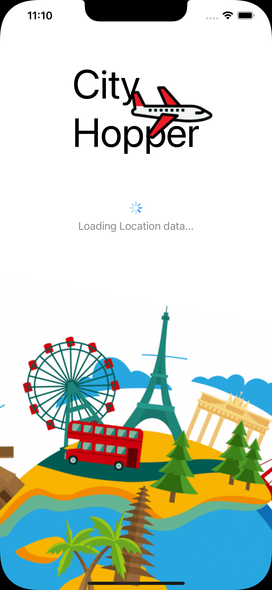
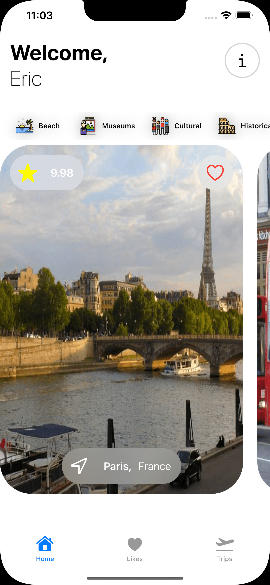
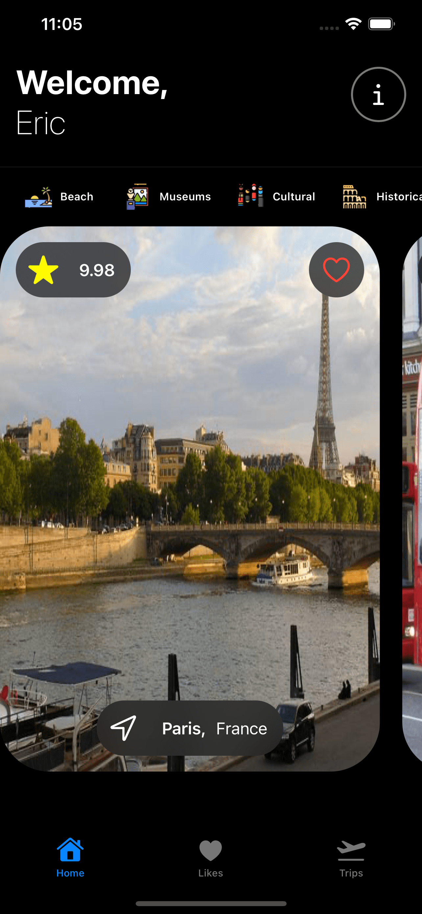

#  City Hopper

&nbsp;&nbsp;&nbsp;
&nbsp;&nbsp;&nbsp;

## About the app.

City Hopper is my capstone application the for the Kodeco 2022 iOS Accelerator Bootcamp. The app allows the user to create a travel diary of cities they would like to visit or have already visited.

## Building and running the App.
The app gets location data from the Triposo Location API at [https://www.triposo.com](https://www.triposo.com). You will need to register for a developer account at [https://www.triposo.com/api/signup](https://www.triposo.com/api/signup). Once you have registerd for an acount you will need create the Secrets.xcconfig in the Configuration directory. The Secrets file needs to have the following two lines.

TRIPOSO\_ACCOUNT = \<Your Account ID>  
TRIPOSO\_TOKEN = \<Your API token>  

## Concepts demonstrated
The app is built in Swift and SwiftUI utlizing the MVVM pattern.

* Fetching JSON from a remote endpoint
* Fetching images from a remote endpoint
* iOS Networking with URLSession
* Swift Modern Concurrency
* Core Data
* Unit and UI Test
