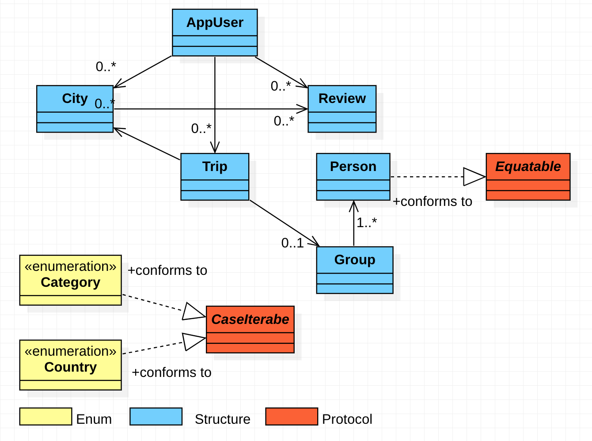

#  City Hopper

## About the app.

City Hopper is an app that allows the user to select one or more cities to visit. The 
trips can be planned for a single user or a group. Users will be able to choose cities 
to visit and add them to a trip planning list. Users can write reviews on the cities
they have visited and upload pictures from their trip.

## What is in this week's homework. (branch homework/week08)

The app has two screens at this time. A home screen where the user lands after starting the app.
And an Onboarding Screen that provides a little information about the app. The Onboarding screen
is displayed as a modal sheet when the user clicks Folder button on the home screen. The user
can dismiss the Onboarding screen by clicking the "Return to App" button.

The apps HomeScreen now displays a scrollable list of cities. Each item in the list contains
an image of the city, name and location, rating and like button. Clicking the city will display
a detail view with the picture and details of the city.

## Data Model used in City Hopper

## Concepts learned this week.

* Networking with URLSession
* URLSessionConfiguration
* Downloading
* Downloading in the background
* Pause/Resume/Cancel Download
* Modern Swift Concurrency using Async/Wait
* SwiftUI Animation
